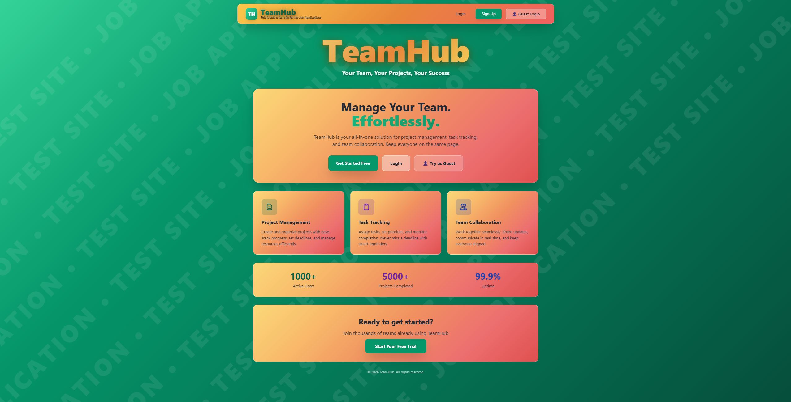
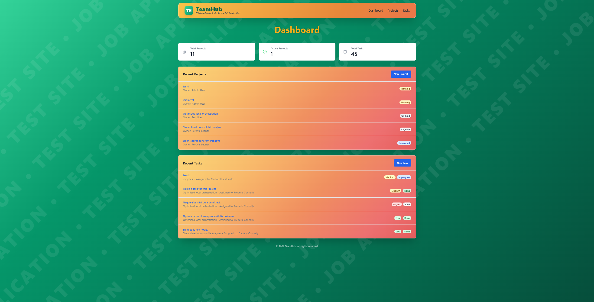
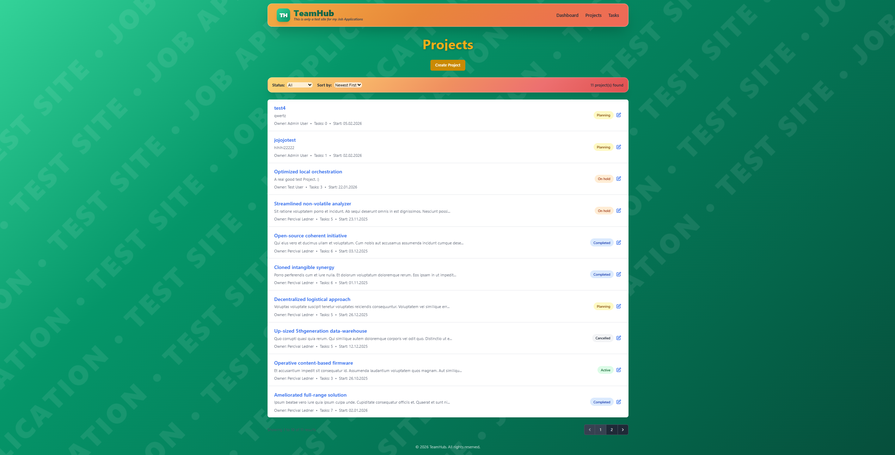
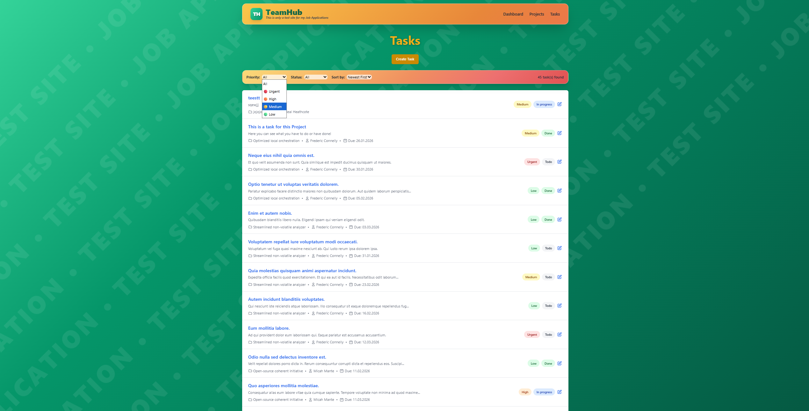
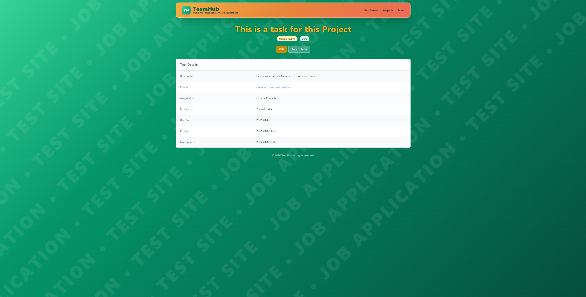

# TeamHub

An internal web application for managing employees, projects, and tasks. Built with Laravel 12, it provides both a web interface and a REST API for small teams or internal departments.


## Screenshots

### Landing Page


### Dashboard


### Projects


### Tasks


### Task Detail


### Features

- User Management — Manage team members and their roles
- Project Management — Full CRUD operations with status tracking (Planning, Active, On Hold, Completed, Cancelled)
- Task Management — Create, assign, and track tasks with priorities and due dates
- Filtering & Sorting — Filter tasks by priority/status, sort by date
- REST API — Full RESTful API with token-based authentication via Laravel Sanctum
- Web Interface — Clean, responsive dashboard built with Tailwind CSS
- Test Suite — 21 tests with 136 assertions using Pest


## Tech Stack

| Technology | Purpose |
|---|---|
| Laravel 12 | Web Framework |
| PHP 8.4 | Backend Language |
| SQLite | Database |
| Laravel Sanctum | API Authentication |
| Tailwind CSS | UI Styling |
| Pest | Testing Framework |

---


### Getting Started

Requirements
   - PHP 8.4+
   - Composer
   - Node.js & npm

### Installation

1. **Clone repository**
```bash
git clone https://github.com/JulienOne1/teamhub.git
cd teamhub
```

2. **Install dependencies**
```bash
composer install
npm install
```

3. **Setup environment**
```bash
cp .env.example .env
php artisan key:generate
```

4. **Create database**
```bash
touch database/database.sqlite
php artisan migrate --seed
```

5. **Start server**
```bash
php artisan serve
```


Visit `http://127.0.0.1:8000` — the app is ready.


### Default Test Credentials

| Role | Email | Password |
|---|---|---|
| Admin | admin@teamhub.test | password |

---

### Project Structure
```
teamhub/
├── app/
│   ├── Http/
│   │   ├── Controllers/
│   │   │   ├── Api/                # REST API Controllers
│   │   │   │   ├── AuthController.php
│   │   │   │   ├── ProjectController.php
│   │   │   │   ├── TaskController.php
│   │   │   │   └── UserController.php
│   │   │   └── Web/                # Web Interface Controllers
│   │   │       ├── DashboardController.php
│   │   │       ├── ProjectController.php
│   │   │       └── TaskController.php
│   │   └── Resources/              # API Resources
│   │       ├── UserResource.php
│   │       ├── ProjectResource.php
│   │       └── TaskResource.php
│   └── Models/
│       ├── User.php
│       ├── Project.php
│       └── Task.php
├── database/
│   ├── factories/
│   ├── migrations/
│   └── seeders/
├── resources/views/                # Blade Templates
│   ├── layouts/
│   ├── dashboard.blade.php
│   ├── projects/
│   └── tasks/
├── routes/
│   ├── web.php                     # Web Routes
│   └── api.php                     # API Routes
└── tests/
    └── Feature/
        └── Api/
            ├── AuthTest.php
            ├── ProjectTest.php
            ├── TaskTest.php
            └── UserTest.php
```
---

## REST API

### Base URL
```
http://127.0.0.1:8000/api
```

### Authentication
All protected endpoints require a Bearer token:

    Authorization: Bearer YOUR_ACCESS_TOKEN

### Endpoints Overview

|Method  |Endpoint                 |Description              |Auth|
|--------|-------------------------|-------------------------|---|
|POST    |/api/register            | Register a new user     |❌|
|POST    |/api/login               | Login and get token     |❌|
|POST    |/api/logout              | Logout current user     |✅|
|GET     |/api/me                  | Get current user        |✅|
|GET     |/api/projects            | List all projects       |✅|
|POST    |/api/projects            | Create a project        |✅|
|GET     |/api/projects/{id}       | Get single project      |✅|
|PUT     |/api/projects/{id}       | Update a project        |✅|
|DELETE  |/api/projects/{id}       | Delete a project        |✅|
|GET     |/api/projects/{id}/tasks | Get project tasks       |✅|
|GET     |/api/tasks               | List all tasks          |✅|
|POST    |/api/tasks               | Create a task           |✅|
|GET     |/api/tasks/{id}          | Get single task         |✅|
|PUT     |/api/tasks/{id}          | Update a task           |✅|
|DELETE  |/api/tasks/{id}          | Delete a task           |✅|
|GET     |/api/users               | List all users          |✅|
|GET     |/api/users/{id}          | Get single user         |✅|
|GET     |/api/users/{id}/projects | Get user's projects     |✅|
|GET     |/api/users/{id}/tasks    | Get user's tasks        |✅|
----------------------------------------------------------------

### Available Values

#### Project Status
| Value | Description |
|---|---|
| `planning` | Project is in planning phase |
| `active` | Project is currently active |
| `on_hold` | Project is on hold |
| `completed` | Project is completed |
| `cancelled` | Project is cancelled |

#### Task Priority
| Value | Description |
|---|---|
| `low` | Low priority |
| `medium` | Medium priority |
| `high` | High priority |
| `urgent` | Urgent priority |

#### Task Status
| Value | Description |
|---|---|
| `todo` | Task is pending |
| `in_progress` | Task is in progress |
| `review` | Task is in review |
| `done` | Task is completed |

---


### Test Coverage

| Test File | Tests | Description |
|---|---|---|
| AuthTest      | 8 | Registration, login, logout, authentication |
| ProjectTest   | 8 | Project CRUD and relationships |
| TaskTest      | 8 | Task CRUD and status updates |
| UserTest      | 5 | User data, projects and tasks |
| **Total**     | **21** | **136 assertions** |

---


## License

This project is open source and available under the [MIT License](LICENSE).